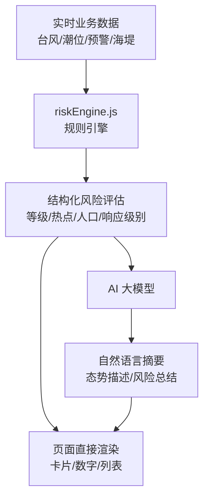
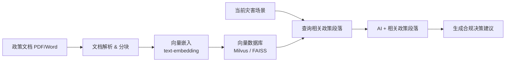

# AI 功能设计方案

> 广东省海洋灾害综合决策系统 — AI 特色功能集成设计

## 总体架构

```mermaid
graph LR
    A[Vue 前端] -->|fetch / SSE| B[gdhz-bff]
    B -->|WebSocket bridge| C[AionUi Agent Gateway<br/>:25808]
    B -->|SQL / API| D[业务数据<br/>潮位 / 台风 / 预警]
    B -->|RAG 检索(二期)| E[知识库<br/>政策文档 & 预案模板]
    C --> F[Agent / CLI / 模型]
```

### 分期基线（与 BFF 实施方案对齐）

- **本期（阶段1）唯一基线**：前端仅调用 `gdhz-bff`，由 BFF 对接 `AionUi bridge`；不在 gdhz 侧新增“直连大模型 API”链路。
- **二期/三期演进**：在 BFF 内增加 RAG、模板生成、更多业务 API；前端接口保持 `/api/ai/*` 不变。
- **实施主文档**：`gdhz-ai-bff-aionui-implementation-plan.md`，本文档定位为能力规划与功能拆解。

### 核心原则：代码 + AI 分工

| 内容类型 | 负责方 | 说明 |
|----------|--------|------|
| 风险等级、热点排序、影响人口 | **代码规则引擎** | 确定性计算，100% 可靠 |
| 态势描述、决策建议文本、简报 | **AI 大模型** | 自然语言生成，有兜底机制 |

> AI 降级策略：当 AI 不可用时，使用代码生成的模板文本替代，确保页面核心功能不受影响。

---

## 功能一：智能态势研判

**改造组件**：`AISituationSummary.vue`

**现状**：数据来自本地 `mockAISummaryData`，所有研判内容为硬编码 JSON。

### 改造方案



#### 代码负责（规则引擎 `src/utils/riskEngine.js`）

- 海堤漫顶风险判定：`预测潮位(天文潮+增水) > 海堤设计标高` → 生成热点
- 风险等级判定：按热点数量和严重程度分 高/中/低
- 响应等级建议：对照应急预案标准（气压阈值 + 热点数量）
- 影响人口/面积：查询普查数据库

#### AI 负责（仅文字生成）

输入 = 代码计算好的结构化 JSON，输出 = 3 段自然语言：

| 字段 | 示例 |
|------|------|
| `situationSummary` | "台风'格美'快速逼近，多段海堤面临漫顶风险，沿海防御形势严峻。" |
| `riskHighlight` | "南澳海堤超设计标准0.8m最为突出，汕尾段同样需重点关注。" |
| `actionAdvice` | "建议启动II级响应，优先转移南澳低洼区域群众。" |

#### 渲染策略

- 数字/等级/列表：代码直出，**秒级渲染**
- 文字摘要：异步加载，带 `AI 摘要生成中...` 骨架屏
- AI 失败兜底：`"当前${riskLevel}，${hotspots.length}处风险点"` 模板文本

---

## 功能二：智能防灾助手

**改造组件**：`AIAssistant.vue`

**现状**：纯 Mock 关键词匹配（`getMockResponse`），无真实 AI 能力。

### 改造方案

#### 上下文感知

每次发送消息前，自动从 Pinia Store 收集实时状态注入 system prompt：

```
注入内容：
- 当前页面（态势感知 / 风浪潮）
- 台风信息（名称/气压/风速/距离）
- 活跃预警列表
- 当前响应等级
- 异常站点列表
```

用户问"当前情况怎么样" → AI 已知全局态势，给出针对性回答。

#### 流式对话

- 使用 SSE (Server-Sent Events) 实现逐字输出
- 前端实时渲染打字效果（替代当前的 `setTimeout` 模拟）

#### 操作联动

AI 回复中嵌入带标记的操作指令，前端解析后渲染为可点击按钮：

```
AI 原始回复：
"珠海站潮位已超警戒0.3m [[action:locate_station|id=zhuhai|label=查看珠海站]]"

前端渲染为：
"珠海站潮位已超警戒0.3m [🔗 查看珠海站]"  ← 可点击，联动地图定位
```

支持的操作类型：

| 操作 | 效果 |
|------|------|
| `locate_station` | 地图定位到指定站点 |
| `locate_risk` | 定位风险区域 |
| `show_alert` | 打开预警详情 |
| `show_seawall` | 定位海堤段 |

---

## 功能三：AI 决策建议

**改造组件**：`DecisionSuggestions.vue`

**现状**：关键措施清单为硬编码数组（6 条固定措施），无论灾害场景如何变化内容相同。

### 改造方案

#### 代码负责

- 响应等级判定（已有，保持不变）
- 灾害类型识别 → 匹配对应政策文档

#### AI 负责

根据实时灾害数据 + 政策文档参考，**动态生成**针对性的行动清单。

#### 政策文档配合（知识库 / RAG）

> **关键依赖**：决策建议必须合规、有据可依，需配合以下政策文档：

| 文档类型 | 用途 | 接入方式 |
|----------|------|----------|
| 《海洋灾害应急预案》 | 响应等级判定标准、各级职责 | 向量化后作为 RAG 知识库 |
| 《风暴潮、海浪灾害应急处置规程》 | 具体处置措施清单 | 向量化后作为 RAG 知识库 |
| 《防台风工作指引》 | 台风各阶段防御要点 | 向量化后作为 RAG 知识库 |
| 《沿海地区人员转移方案》 | 转移路线、安置点 | 结构化数据，代码直接引用 |
| 各地市防灾减灾具体细则 | 区县级个性化措施 | 按地区分库 |

**RAG 工作流**：



#### 输出增强

相比现在的 6 条固定措施，AI 生成的建议增加：

- **优先级排序**：根据灾害紧迫程度排序
- **时间节点**：如"建议在 XX 时前完成渔船回港"
- **责任归属**：关联到对应部门
- **政策依据**：标注来源文件名和条款号（如"依据《应急预案》第3.2条"）

---

## 功能四：智能方案生成

**新增功能**，入口设在 `DecisionSuggestions.vue` 的快捷操作区。

### 功能定位

一键生成可导出的结构化灾害简报 / 应急方案文档（Word / PDF）。

### 模板体系

> **关键依赖**：简报和方案必须符合单位公文格式要求，需配合固定模板。

#### 模板分类

| 模板名称 | 使用场景 | 格式 |
|----------|----------|------|
| 灾害情况简报模板 | 灾害发生期间周期性上报 | Word (docx) |
| 应急响应启动/终止报告模板 | 响应等级变更时 | Word (docx) |
| 防御措施落实情况通报模板 | 各级单位汇报 | Word (docx) |
| 灾后损失评估报告模板 | 灾害结束后 | Word (docx) |

#### 模板结构（以灾害情况简报为例）

```
┌──────────────────────────────────────────────────┐
│         广东省海洋灾害情况简报                     │
│                                                  │
│  编号：粤海灾〔2026〕XX号      [代码自动编号]     │
│  时间：2026年XX月XX日 XX:XX    [代码自动填充]     │
│                                                  │
│  一、灾害概况                   [AI 生成]         │
│  二、影响范围                   [代码数据 + AI]    │
│  三、已采取措施                 [AI 基于操作日志]  │
│  四、下一步工作安排             [AI 生成]          │
│  五、附图                       [系统截图自动嵌入] │
│                                                  │
│  签发单位：XXX                  [模板固定]         │
│  联系电话：XXX                  [模板固定]         │
└──────────────────────────────────────────────────┘
```

#### 各部分数据来源

| 章节 | 数据来源 | 生成方式 |
|------|----------|----------|
| 文档编号、时间、签发 | 系统配置 | **代码** 自动填充 |
| 灾害概况 | 台风参数 + 预警信号 | **AI** 生成自然语言 |
| 影响范围 | 代码计算的影响人口/面积 | **代码** 填表 + **AI** 串联描述 |
| 已采取措施 | 操作日志/已触发的行动 | **AI** 整理为公文格式 |
| 下一步安排 | 功能三的决策建议 | **AI** 改写为公文体 |
| 附图 | 大屏态势截图 | **代码** html2canvas 截图 |

#### 技术实现

```mermaid
graph TB
    A[用户点击"生成方案"] --> B[代码收集当前态势数据]
    B --> C[代码自动填充模板固定字段]
    C --> D[AI 生成自然语言章节]
    D --> E[合并到 Word 模板]
    E --> F[生成 docx 文件]
    F --> G[预览 & 下载]
```

- 前端使用 `docxtemplater` 或类似库填充 Word 模板
- 或由后端生成 docx 返回下载链接
- 支持生成前预览，用户可微调后再导出

---

## 实施路线

### 第一阶段：基础对接（1-2 周）

- [ ] 搭建后端 AI 代理层（gdhz-bff，对接 AionUi）
- [ ] 新增 `src/api/ai.js` API 模块
- [ ] 升级 `AIAssistant.vue` → 流式对话 + 上下文感知
- [ ] 创建 `src/utils/riskEngine.js` 规则引擎

### 第二阶段：深度集成（2-4 周）

- [ ] 升级 `AISituationSummary.vue` → AI 实时态势研判
- [ ] 升级 `DecisionSuggestions.vue` → AI 动态决策建议
- [ ] 构建政策文档 RAG 知识库

### 第三阶段：方案生成（2-3 周）

- [ ] 设计并制作 Word 模板体系
- [ ] 实现智能方案生成功能
- [ ] 对接截图能力（html2canvas）
- [ ] 预览与导出流程

---

## 技术选型建议

| 组件 | 推荐方案 |
|------|----------|
| Agent 网关（本期） | AionUi WebServer + Bridge（25808） |
| 大模型（经 AionUi 配置） | 通义千问 (Qwen) / DeepSeek |
| 流式传输 | SSE (Server-Sent Events) |
| RAG 向量库 | FAISS（轻量）/ Milvus（生产级） |
| 文档嵌入 | text-embedding-v3 (阿里) |
| Word 生成 | docxtemplater (前端) / Apache POI (后端) |
| 截图 | html2canvas |

## 注意事项

- **数据安全**：使用国产大模型，敏感数据由后端脱敏后再传给 AI
- **AI 可靠性**：所有结构化数据由代码保证，AI 仅负责文字润色
- **性能**：AI 响应做后端缓存，同一场景 5 分钟内复用
- **公文合规**：方案/简报模板需由业务部门审定后固化
